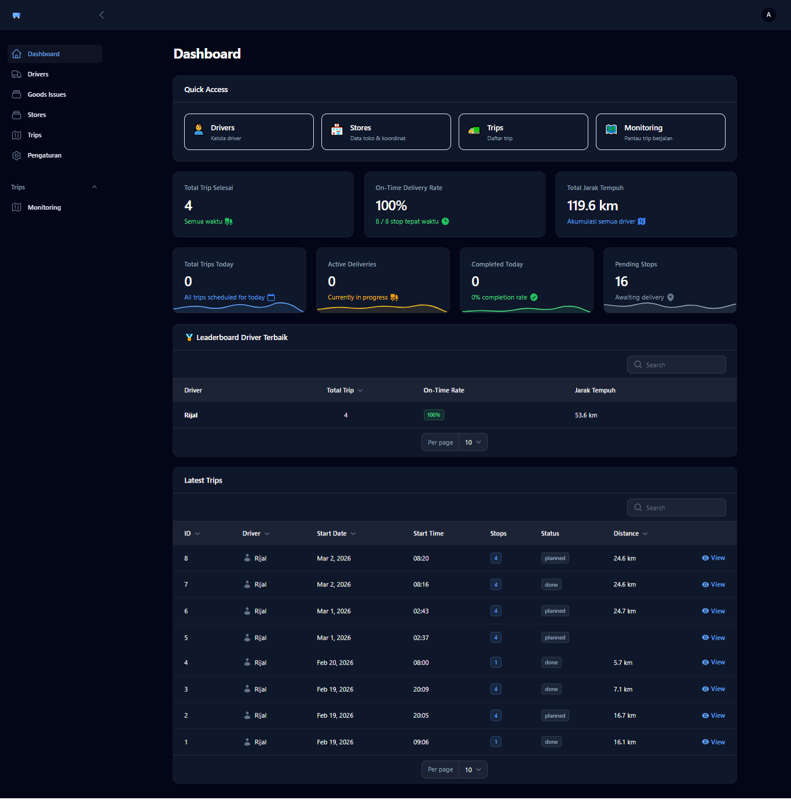

# 🚚 DeliveryV3 - Smart Delivery Management System

[](https://laravel.com)
[](https://filamentphp.com)
[](LICENSE)

DeliveryV3 adalah sistem manajemen pengiriman modern yang membantu tim operasional mengatur perjalanan driver, mengoptimalkan rute kunjungan ke toko, dan memantau trip secara real-time melalui peta interaktif.


> 📝 **Note**: Screenshot akan ditambahkan di folder `docs/screenshots/`

---

## ✨ Fitur Utama

### 🗺️ Route Optimization
- **Optimasi Rute Otomatis** dengan OpenRouteService (ORS)
- **Perhitungan ETA Akurat** menggunakan real-time traffic data
- **Visualisasi Rute** di peta interaktif dengan Leaflet.js
- **Support Multiple Vehicle Profiles** (Car, HGV/Truck, dll)

### 📦 Trip Management
- **Goods Issue (GI) Integration** - Import trip dari Excel
- **Manual Trip Creation** - Input toko satu per satu
- **Multi-GI Assignment** - Gabungkan beberapa GI dalam satu trip
- **Automatic Store Grouping** - Menggabungkan items dengan toko yang sama
- **Sequence Management** - Urutan kunjungan yang optimal

### 👤 Driver Panel
- **Real-time Trip Monitoring** - Lihat trip yang sedang berjalan
- **Interactive Map** - Peta dengan rute dan marker toko
- **Stop Status Management** - Update status: Pending → Arrived → Done
- **Geofencing** - Auto-detect arrival/departure (100m radius)
- **Trip Progress Tracking** - Monitor stop yang sudah dikunjungi

### 📊 Admin Panel
- **Dashboard Overview** - Statistik trip dan monitoring
- **Store Management** - Kelola data toko dengan koordinat
- **Driver Management** - Manajemen user dan assignment
- **Goods Issue Management** - Tracking GI dan statusnya
- **Monitoring Page** - Auto-refresh untuk trip aktif

### 📍 Store & Coordinate Management
- **Geocoding Integration** - Otomatis fetch koordinat dari alamat
- **Coordinate Validation** - Pastikan koordinat valid sebelum routing
- **Bulk Import** - Import toko via Excel
- **Smart Matching** - Automatic matching store_id dan store_name

### 📱 Mobile App (Android)
- **Native Android App** - Built with Capacitor
- **GPS Tracking** - Real-time location updates
- **Offline Support** - Work without internet connection
- **Background Location** - Continue tracking when app minimized
- **Push Notifications** - Trip updates and reminders

> 📖 **Build APK Guide**: See [BUILD_ANDROID_APK.md](BUILD_ANDROID_APK.md) for step-by-step instructions

---

## 🛠️ Tech Stack

### Backend
- **Framework**: [Laravel 11.x](https://laravel.com) - Modern PHP framework
- **Admin Panel**: [Filament 3.x](https://filamentphp.com) - Powerful TALL stack admin panel
- **Database**: MySQL 8.0+
- **Queue**: Laravel Queue (Database driver)
- **Excel Processing**: [Maatwebsite/Excel](https://laravel-excel.com)
- **Permissions**: [Spatie Laravel Permission](https://spatie.be/docs/laravel-permission)

### Frontend
- **Build Tool**: [Vite](https://vitejs.dev)
- **CSS Framework**: Tailwind CSS
- **Maps**: [Leaflet.js](https://leafletjs.com) - Interactive maps
- **Icons**: Blade Icons & Heroicons

### External APIs
- **OpenRouteService (ORS)**: 
  - Route Optimization (`/optimization`)
  - Distance Matrix (`/matrix`)
  - Directions (`/directions`)
- **Vehicle Profiles**: driving-car, driving-hgv

### Mobile (Android)
- **Framework**: [Capacitor](https://capacitorjs.com) - Native mobile runtime
- **Platform**: Android (iOS support possible)
- **Geolocation**: Capacitor Geolocation Plugin
- **Background Tasks**: Android Foreground Service
- **Build**: Android Studio + Gradle

### Development Tools
- **PHP**: 8.2+
- **Composer**: Dependency management
- **Node.js**: 18+
- **npm/npx**: Frontend tooling

---

## 📋 System Requirements

- **PHP** >= 8.2 with extensions: `mbstring`, `xml`, `bcmath`, `pdo_mysql`, `zip`, `gd`
- **MySQL** >= 8.0 atau MariaDB >= 10.3
- **Composer** >= 2.5
- **Node.js** >= 18.x
- **Web Server**: Apache/Nginx (XAMPP/Laragon for Windows)

---

## 🚀 Installation

### ⚡ One-Click Installation (Recommended)

**Prerequisites:**
- XAMPP (PHP 8.2+, MySQL running)
- Composer
- Node.js (v18+)

**Installation Steps:**

1. **Run Installer**
   ```
   Right-click install.bat → Run as Administrator
   ```

2. **Configure API Key**
   
   Edit `.env` and add your ORS API Key:
   ```env
   ORS_API_KEY=your_api_key_here
   ```
   
   Get free API key at: https://openrouteservice.org

3. **Start Application**
   ```
   Double-click start_server.bat
   ```
   
   Browser will auto-open at http://127.0.0.1:8000/admin

**That's it! 🎉**

> 📖 For detailed installation guide and troubleshooting, see [INSTALLATION.md](INSTALLATION.md)

### Manual Installation

If automated installer fails, follow manual installation steps in [INSTALLATION.md](INSTALLATION.md#manual-installation)


### Critical Configuration (.env)

**OpenRouteService API Key** (WAJIB untuk fitur routing):

1. Daftar di [OpenRouteService](https://openrouteservice.org/)
2. Dapatkan API Key gratis
3. Tambahkan ke `.env`:
   ```env
   ORS_API_KEY=your_api_key_here
   ORS_PROFILE=driving-car
   ```

**Warehouse Coordinates** (Default starting point):
```env
WAREHOUSE_LAT=-3.356837
WAREHOUSE_LNG=114.577059
```

**Service Time Configuration**:
```env
SERVICE_MINUTES=15
TRAFFIC_FACTOR=1.30
```

---

## 🏃 Running the Application

### Development Mode

**Terminal 1** - Application Server:
```bash
php artisan serve
```

**Terminal 2** - Queue Worker (untuk background jobs):
```bash
php artisan queue:work
```

**Terminal 3** - Frontend Dev Server (optional, untuk live reload):
```bash
npm run dev
```

Akses aplikasi di: **http://127.0.0.1:8000**

### Production Mode

Untuk deployment production, lihat [DEPLOYMENT_GUIDE.md](DEPLOYMENT_GUIDE.md)

---

## 📖 Usage Guide

### Creating a Trip (via GI Import)

1. Buka **Admin Panel** → **Trips**
2. Klik **New Trip**
3. Masukkan **GI Numbers** (contoh: `GI126/0200001, GI126/0200002`)
4. Pilih **Driver** dan **Start Date/Time**
5. Klik **Create**
6. Trip akan otomatis membuat stops dari GI items

### Generating Optimized Route

1. Buka **Trip Detail Page**
2. Klik tombol **"Generate Route (ORS)"**
3. Sistem akan:
   - Mengoptimalkan urutan stop (minimize distance)
   - Menghitung ETA untuk setiap stop
   - Membuat visualisasi rute di peta
4. Refresh page untuk melihat hasil

### Running a Trip (Driver Side)

1. Login sebagai **Driver**
2. Buka **My Trips**
3. Klik trip yang ingin dijalankan
4. Klik **"Run Trip"**
5. Map akan menampilkan rute dan current location
6. Update status stop: **Arrived** → **Done**

---

## 📁 Project Structure

```
deliveryv3/
├── app/
│   ├── Filament/          # Admin & Driver panels
│   │   ├── Admin/         # Admin resources
│   │   └── Driver/        # Driver resources
│   ├── Models/            # Eloquent models
│   ├── Services/          # Business logic
│   │   ├── OrsService.php         # OpenRouteService API
│   │   ├── TripRouteGenerator.php # Route optimization
│   │   └── TripAssignmentService.php
│   ├── Imports/           # Excel import handlers
│   └── Jobs/              # Background jobs
├── config/
│   ├── delivery.php       # Warehouse & routing config
│   └── services.php       # External API config
├── database/
│   └── migrations/        # Database schema
├── resources/
│   └── views/             # Blade templates
├── routes/
│   ├── web.php           # Web routes
│   └── api.php           # API routes
└── public/               # Public assets
```

---

## 🗄️ Database Schema

### Core Tables

- **`trips`** - Perjalanan driver
- **`trip_stops`** - Kunjungan ke toko (dengan sequence & ETA)
- **`stores`** - Data toko & koordinat
- **`goods_issues`** - Data GI dari import
- **`goods_issue_items`** - Items per GI
- **`trip_invoices`** - Invoice yang terkait dengan stop

### Key Relationships

```
Trip 
  ├── hasMany TripStop
  ├── belongsTo User (Driver)
  └── hasMany GoodsIssue

TripStop
  ├── belongsTo Trip
  ├── belongsTo Store
  └── hasMany TripInvoice

Store
  └── hasMany TripStop

GoodsIssue
  ├── belongsTo Trip
  └── hasMany GoodsIssueItem
```

---

## 🔧 Configuration Files

### `config/delivery.php`
```php
return [
    'warehouse_lat' => env('WAREHOUSE_LAT', -3.356837),
    'warehouse_lng' => env('WAREHOUSE_LNG', 114.577059),
    'service_minutes' => env('SERVICE_MINUTES', 15),
    'traffic_factor' => env('TRAFFIC_FACTOR', 1.30),
    'ors_profile' => env('ORS_PROFILE', 'driving-car'),
    'auto_arrive_radius_meters' => env('AUTO_ARRIVE_RADIUS_METERS', 100),
];
```

### `config/services.php`
```php
'ors' => [
    'key' => env('ORS_API_KEY'),
    'base_url' => 'https://api.openrouteservice.org',
],
```

---

## 🐛 Troubleshooting

### Route tidak muncul di peta
- ✅ Pastikan `ORS_API_KEY` sudah di-set di `.env`
- ✅ Cek semua stores punya koordinat valid (bukan NULL)
- ✅ Klik "Generate Route (ORS)" manual di trip detail

### Stop sequence NULL / tidak berurutan
- ✅ Regenerate route dengan klik "Generate Route (ORS)"
- ✅ Pastikan tidak ada duplicate store_id di trip yang sama

### Queue job tidak jalan
- ✅ Jalankan `php artisan queue:work` di terminal terpisah
- ✅ Cek `QUEUE_CONNECTION=database` di `.env`

---

## 📚 Additional Documentation

- **[INSTALLATION.md](INSTALLATION.md)** - Detailed installation guide
- **[TECHNICAL_OVERVIEW.md](TECHNICAL_OVERVIEW.md)** - System architecture
- **[DEPLOYMENT_GUIDE.md](DEPLOYMENT_GUIDE.md)** - Production deployment
- **[BUILD_ANDROID_APK.md](BUILD_ANDROID_APK.md)** - Build mobile app

---

## 🤝 Contributing

Contributions are welcome! Please feel free to submit a Pull Request.

---

## 📄 License

This project is licensed under the MIT License.

---

## 👨‍💻 Developer

Built with ❤️ using Laravel & Filament

---

## 📞 Support

Jika ada pertanyaan atau issue, silakan buat issue di repository ini atau hubungi tim development.