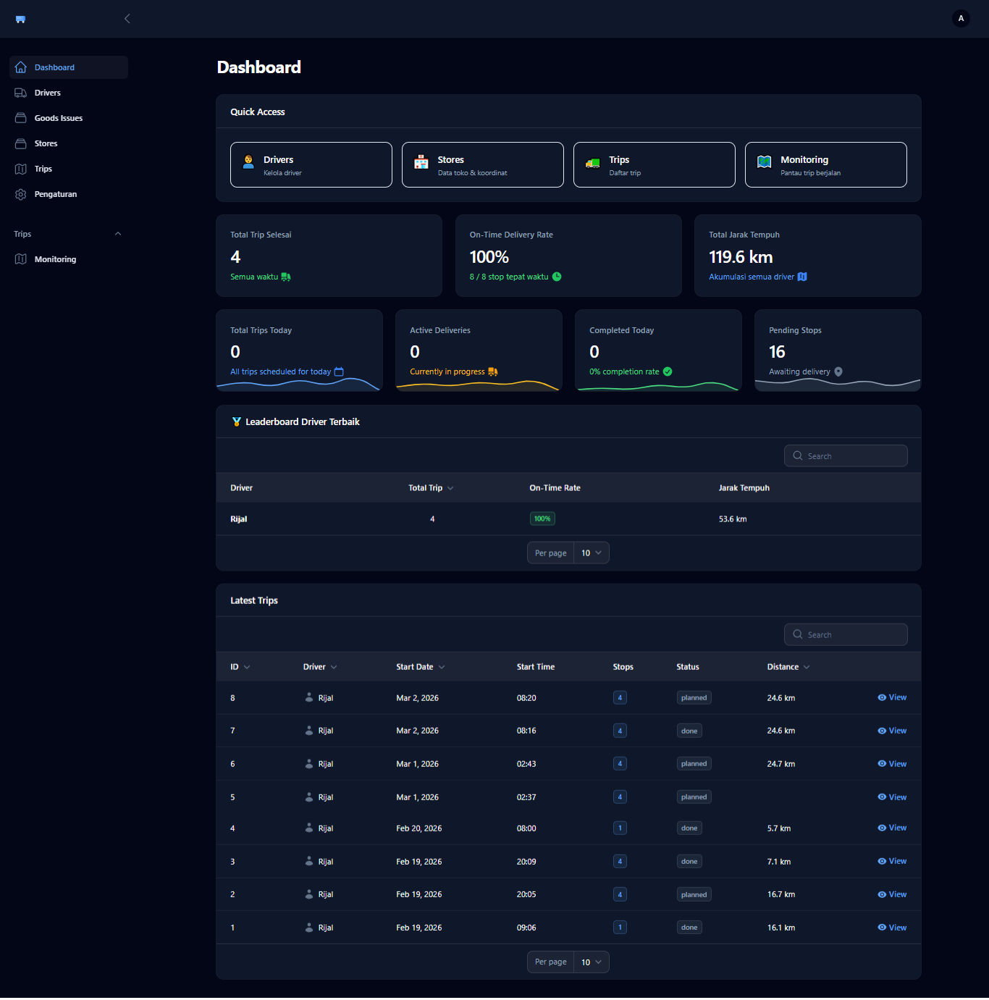
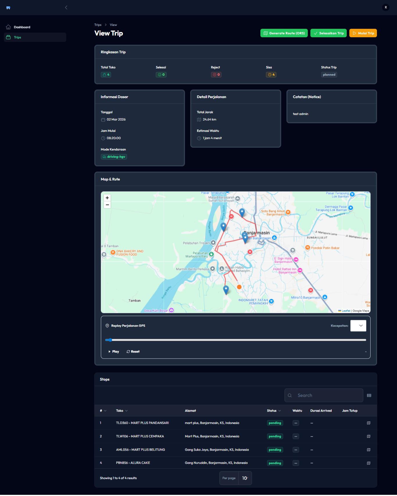
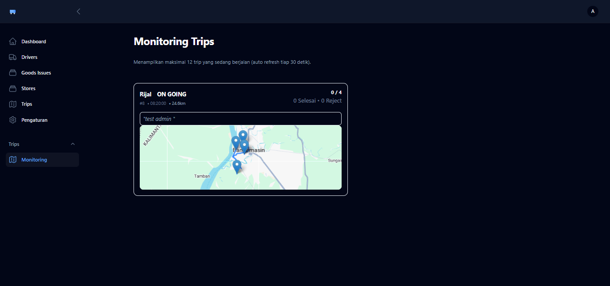
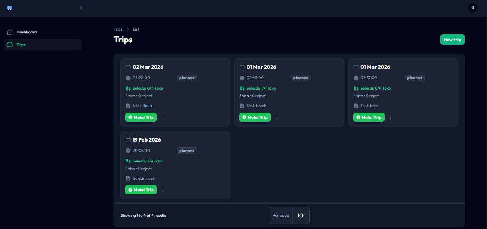
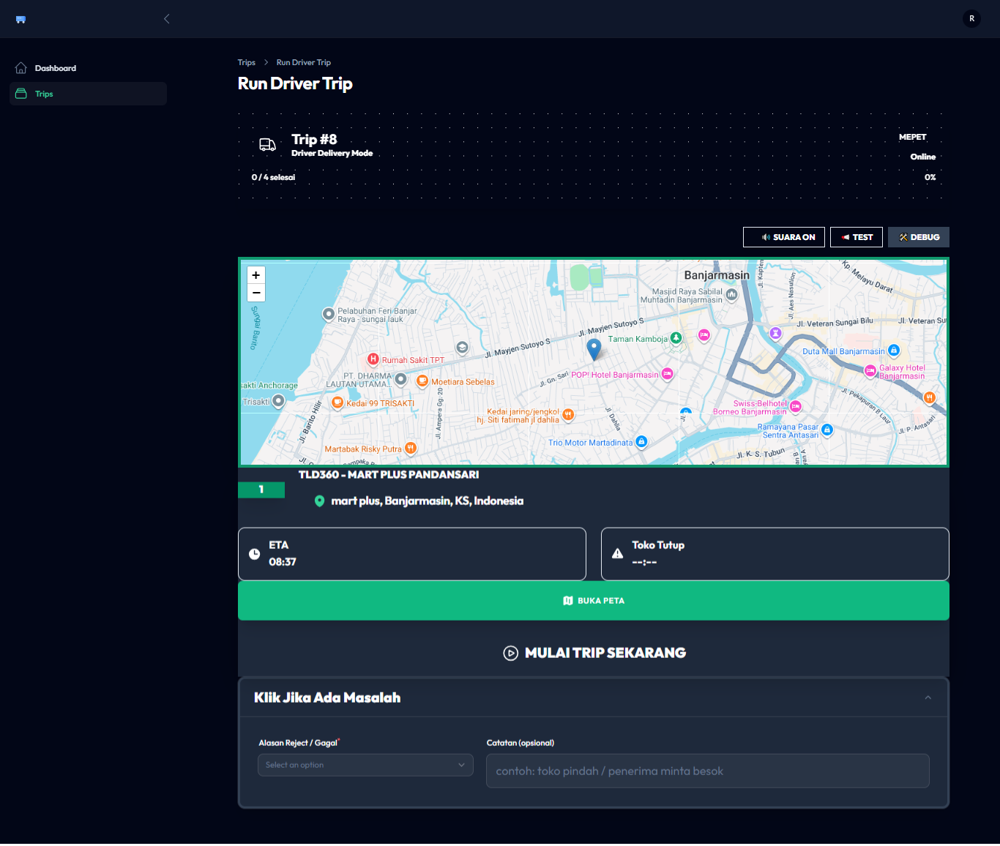

# 🎙️ Presentation Guide: DeliveryV3
### Smart Delivery Management System

Materi ini dirancang untuk membantu presentasi sistem **DeliveryV3**. Anda bisa membacanya langsung atau mengonversinya ke format slide (seperti Slidev atau Marp).

---

## Slide 1: Judul & Pendahuluan
**Visual:** Logo DeliveryV3 atau Judul Besar.

- **Judul:** DeliveryV3 — Revolusi Manajemen Pengiriman Pintar.
- **Tagline:** Efisiensi rute, pemantauan real-time, dan optimasi biaya dalam satu platform.

> **🎙️ Speaker Notes:**
> "Halo semuanya, hari ini saya akan mempresentasikan DeliveryV3. Ini bukan sekadar sistem logistik biasa, melainkan solusi modern untuk tantangan pengiriman yang kompleks di era sekarang."

---

## Slide 2: Masalah yang Kita Selesaikan
**Visual:** Ikon rute yang berantakan vs rute yang rapi.

1. **Rute Tidak Efisien:** Kurir sering berputar-putar karena urutan toko yang tidak logis.
2. **Kebutaan Operasional:** Admin tidak tahu posisi driver secara pasti saat di lapangan.
3. **Biaya BBM Membengkak:** Kurangnya data akurat untuk perhitungan estimasi biaya.
4. **Input Manual yang Lambat:** Proses pembuatan trip dari dokumen GI yang memakan waktu.

---

## Slide 3: Penawaran Solusi (The Core)
**Visual:** 

- **Automasi:** Import rute langsung dari dokumen Excel (Goods Issue).
- **Optimasi:** Menggunakan kecerdasan buatan untuk menentukan urutan kunjungan tercepat.
- **Transparansi:** Pemantauan posisi setiap armada setiap detik.

---

## Slide 4: Teknologi di Balik Layar
**Teknologi Utama:**
- **OpenRouteService (ORS):** Otak di balik optimasi rute (VRP/TSP) dan Distance Matrix.
- **Laravel Reverb:** Teknologi WebSocket untuk pelacakan lokasi tanpa delay.
- **PWA (Progressive Web App):** Memungkinkan driver menginstal aplikasi di HP tanpa melalui App Store.

---

## Slide 5: Fitur Unggulan — Optimasi Rute (ORS)
**Visual:** 

- **Optimization Workflow:** Sistem menghitung jam buka toko, jarak tempuh, dan kondisi lalu lintas.
- **Hasil:** Penurunan jarak tempuh hingga 20% dibandingkan rute manual.
- **ETA Akurat:** Estimasi waktu tiba di setiap toko dihitung secara presisi.

---

## Slide 6: Real-Time Monitoring & Geofencing
**Visual:** 

- **Live Tracking:** Admin bisa melihat pergerakan driver secara live di peta.
- **Auto-Arrive:** Deteksi otomatis saat driver sampai di toko (radius geofence).
- **Dwell Time:** Monitoring berapa lama driver berhenti di satu titik.

---

## Slide 7: Pengalaman Driver (Driver Panel)
**Visual:**  | 

- **User-Friendly:** Antarmuka yang bersih, fokus pada peta dan tugas saat ini.
- **Push Updates:** Status pengiriman diupdate dengan satu klik.
- **Offline Ready:** Berkat teknologi Service Worker, aplikasi tetap stabil di jaringan yang kurang baik.

---

## Slide 8: Dampak Bisnis (Business Impact)
1. **Hemat Waktu:** Waktu perencanaan rute turun dari hitungan jam ke hitungan detik.
2. **Hemat Biaya:** Penghematan BBM signifikan melalui rute yang lebih pendek.
3. **Kepuasan Pelanggan:** Pengiriman tepat waktu karena ETA yang akurat.
4. **Data-Driven:** Semua data perjalanan tersimpan untuk analisa performa driver ke depannya.

---

## Slide 9: Penutup & Demo
- **Kesimpulan:** DeliveryV3 adalah masa depan manajemen logistik yang cerdas dan transparan.
- **Link Demo:** [Tunjukkan Monitoring Page Live]

> **🎙️ Speaker Notes:**
> "Terima kasih atas perhatiannya. DeliveryV3 siap membawa operasional pengiriman Anda ke level berikutnya. Silakan jika ada pertanyaan atau mari kita lihat langsung demonya!"
