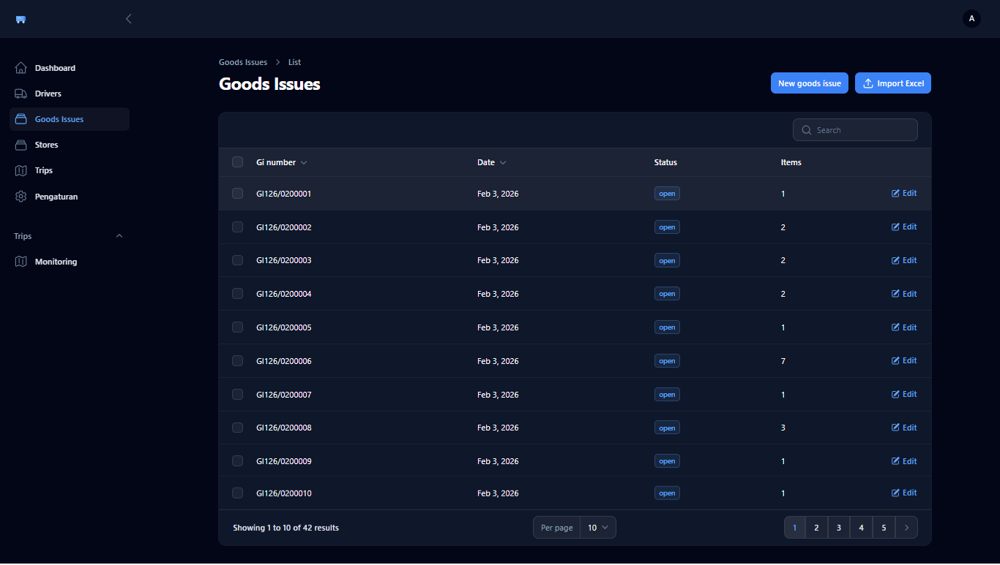
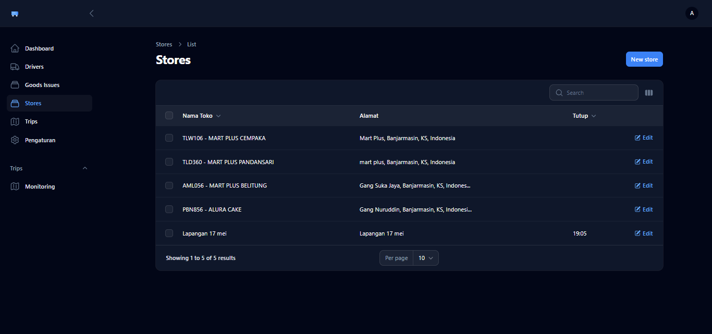
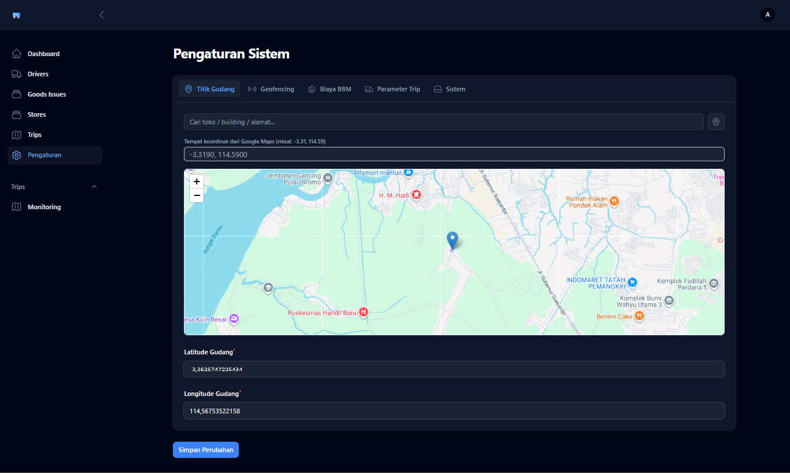

# Screenshots Guide

Folder ini berisi screenshot aplikasi DeliveryV3 untuk dokumentasi.

## Screenshot yang Tersedia

Berikut adalah preview dari screenshot yang sudah diambil:

### 1. Admin Panel
| Dashboard | Trip Detail |
| :---: | :---: |
|  |  |

| Monitoring | Goods Issues |
| :---: | :---: |
|  |  |

| Stores List | Settings |
| :---: | :---: |
|  |  |

### 2. Driver Panel
| Driver Trips | Run Trip |
| :---: | :---: |
|  |  |

## Cara Mengambil Screenshot (Untuk Update)

1. Buka aplikasi di browser.
2. Login sebagai admin atau driver.
3. Gunakan `Windows + Shift + S` untuk mengambil gambar.
4. Simpan di folder ini dengan nama file yang sesuai (misal: `dashboard.png`).

## Penggunaan di README Utama

Gunakan path relatif dari root proyek:
```markdown

```
